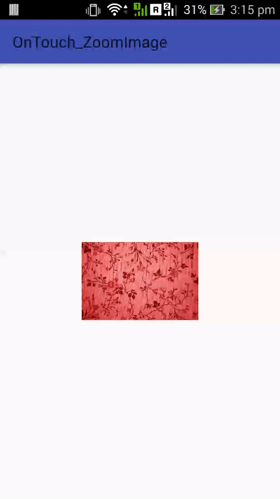

Open Profile Picture like Whatsapp on image onclick 

## Demo

## Usage
   ### Step 1 : Add "OnTouch_ZoomImage" to your Android project.

   1- Open your project in Android Studio.
   2- Download the library
       (using Git Link ---> https://github.com/yash786agg/OnTouch_ZoomImage.git)
                                        or 
       (Download a zip File archive to unzip)
    
   3- Create a folder "OnTouch_ZoomImage" in your project.
   4- Copy and paste the Code to your OnTouch_ZoomImage folder
   5- On the root of your project directory create/modify the settings.gradle file. It should contain something like the following:

      include 'MyApp', ':OnTouch_ZoomImage'

   6- Go to File > Project Structure > Modules.
   7- App > Dependencies.
   8- Click on the more on the left green "+" button > Module dependency.
   9- Select "OnTouch_ZoomImage Library".

### Step 2 : Add Code to your Project

By creating an imageview that will display the smaller image, that when clicked will play an animation, and at the end reveal an imageview with the full sized image in it.

### Xml Code:

The layout they give as an example is this:

<RelativeLayout
    xmlns:android="http://schemas.android.com/apk/res/android"
    android:id="@+id/main_rltv"
    android:layout_width="match_parent"
    android:layout_height="match_parent">

    <ImageView
        android:id="@+id/main_image"
        android:layout_width="150dp"
        android:layout_height="150dp"
        android:layout_gravity="center"
        android:layout_centerInParent="true" />

    <RelativeLayout
        android:id="@+id/expanded_list_rltv"
        android:layout_width="match_parent"
        android:layout_height="match_parent"
        android:background="@color/transparent_background"
        android:visibility="gone">

        <ImageView
            android:id="@+id/expanded_list_image"
            android:layout_width="match_parent"
            android:layout_height="match_parent"
            android:layout_centerInParent="true" />

        <ProgressBar
            android:id="@+id/expanded_image_progress"
            style="?android:attr/progressBarStyleLarge"
            android:layout_width="wrap_content"
            android:layout_height="wrap_content"
            android:layout_centerInParent="true"
            android:indeterminateTint="@color/navigation_drawer_selected_color"
            android:visibility="gone"/>

    </RelativeLayout>

</RelativeLayout>

### Activity/Fragment Code:

    private ImageView main_image,expanded_list_image;
    private RelativeLayout expanded_list_rltv,main_rltv;
    private ProgressBar expanded_image_progress;
    
    
        main_rltv = (RelativeLayout) findViewById(R.id.main_rltv);

        expanded_list_rltv = (RelativeLayout) findViewById(R.id.expanded_list_rltv);

        expanded_list_image = (ImageView) findViewById(R.id.expanded_list_image);

        main_image = (ImageView) findViewById(R.id.main_image);

        new DownloadImageTask(main_image).execute(image_url);

        expanded_image_progress = (ProgressBar) findViewById(R.id.expanded_image_progress);

        main_image.setOnClickListener(new View.OnClickListener()
        {
            @Override
            public void onClick(View v)
            {
                String image_url = "Your Image URL";
                OnTouch_ZoomImage.zoomImageFromThumb(MainActivity.this,main_image,image_url,expanded_list_rltv,expanded_list_image,expanded_image_progress,main_rltv);
            }
        });
